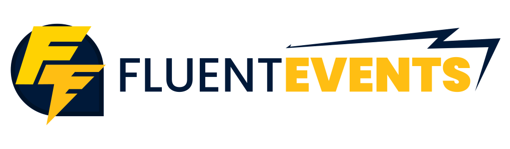

[](https://luca-s.visualstudio.com/FluentEvents/_build/latest?definitionId=8) [](https://www.nuget.org/packages/FluentEvents/)

### What is FluentEvents?
FluentEvents is an [event aggregation](https://martinfowler.com/eaaDev/EventAggregator.html) framework that simplifies event subscriptions when using Dependency Injection and ORMs making even easier to add real-time functionality to your applications.

#### FluentEvents can:
- Simplify **domain events pattern** implementation allowing to create a **fully encapsulated domain model**.
- Help when you have lots of objects that are potential event sources by centralizing the registration.
- Generalize events using projections.
- Publish events to [global subscriptions](https://github.com/luca-esse/FluentEvents/wiki/Global-subscriptions).
- Publish events to [scoped subscriptions](https://github.com/luca-esse/FluentEvents/wiki/Scoped-subscriptions).
- Invoke [SignalR](https://github.com/aspnet/AspNetCore/tree/master/src/SignalR) methods when events are raised.
- Publish events to [global subscriptions](https://github.com/luca-esse/FluentEvents/wiki/Global-subscriptions) on every instance of your application transparently using [Azure Service Bus topics](https://azure.microsoft.com/en-us/services/service-bus/). 

#### How it works:
```csharp
public class NotificationsService
{
    private readonly IMailService _mailService;

    public NotificationsService(MyEventsContext myEventsContext, IMailService mailService)
    {
        myEventsContext.SubscribeGloballyTo<Order>(order =>
        {
            order.Shipped += OrderOnShipped;
        });
        
        _mailService = mailService;
    }

    private async Task OrderOnShipped(object sender, OrderShippedEventArgs e)
    {
        var order = (Order) order;

        await _mailService.SendOrderShippedEmail(order.Buyer.EmailAddress, order.Code);
    }
}
```

### NuGet Packages

| Package                            | Version                                                                                                                                           |
|------------------------------------|:-------------------------------------------------------------------------------------------------------------------------------------------------:|
| FluentEvents                       | [](https://www.nuget.org/packages/FluentEvents/)                                         |
| FluentEvents.EntityFramework       | [](https://www.nuget.org/packages/FluentEvents.EntityFramework/)         |
| FluentEvents.EntityFrameworkCore   | [](https://www.nuget.org/packages/FluentEvents.EntityFrameworkCore/) |
| FluentEvents.Azure.ServiceBus      | [](https://www.nuget.org/packages/FluentEvents.Azure.ServiceBus/)       |
| FluentEvents.Azure.SignalR      | [](https://www.nuget.org/packages/FluentEvents.Azure.SignalR/)       |
